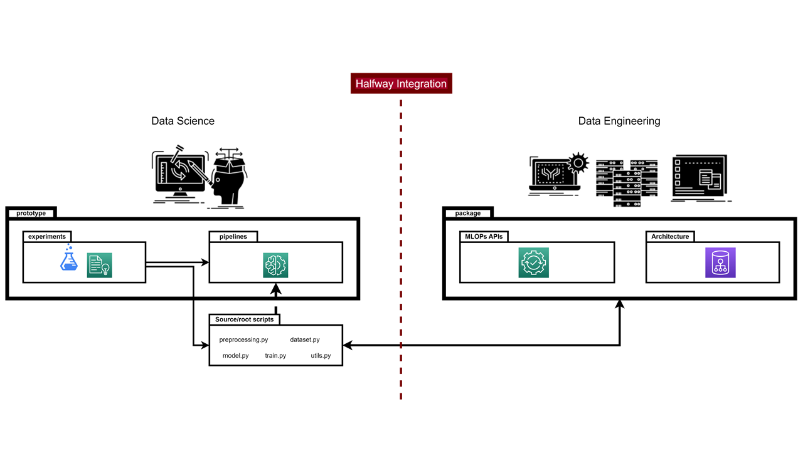

# HIcode guidelines (v2.0)

[**Prototype (DS)**](https://github.com/nmc-costa/HIcode/tree/main/prototype):

[*experiments folder (individual)*](https://github.com/nmc-costa/HIcode/tree/main/prototype/experiments):
The **1st stage** of code (*the lab*). Use it for experimenting with anything you see fit. Put it in a way that can be tested by anyone. The idea is to simplify as much as you can so that you find functions that can be reused (reusable). In later iterations, it should have a similar architecture as the pipelines folder.

[*root/source (team)*](https://github.com/nmc-costa/HIcode/tree/main/prototype):
The **2nd stage** after refining the experiments, reusable functions should be sent to the root/source scripts. The root is a team effort.

- [**utils.py**](https://github.com/nmc-costa/HIcode/blob/main/prototype/utils.py): Contains generic functions/classes and initial coding rules that can be reused (e.g., paths, code column names, etc).
- [**datasets.py**](https://github.com/nmc-costa/HIcode/blob/main/prototype/datasets.py): Contains datasets functions/classes to read the dataset and configurations (e.g.,  read config, read dataset, etc).
- [**preprocessing.py**](https://github.com/nmc-costa/HIcode/blob/main/prototype/preprocessing.py): Includes all the functions/classes that are used to preprocess/prepare the datasets. **NOTE:** Make an effort to create classes of transform (like sikitlearn - check the example provided) so you can maintain the code agnostic and configurable.
- [**models.py**](https://github.com/nmc-costa/HIcode/blob/main/prototype/models.py): Encompasses all the functions/classes that are needed to create models. (reusable functions).
- **train.py**: Comprises all the functions/classes for training routines.

**NOTE:** In the root scripts we should not pass as an argument config dictionary from cfg_pipeline.json, only parameters. This means for example in preprocessing.py instead of def function(config), use def function(parameter) and in the p#_pipeline.py call preprocessing.function(config["parameter"]). This helps maintaing the code clean and easy to read.

[*pipelines folder (team)*](https://github.com/nmc-costa/HIcode/tree/main/prototype/pipelines):
The **3rd stage**, the center of HIcode method, it should be used to create full pipelines with config files. The git already has 1 example of transforming experiment [**e1**](https://github.com/nmc-costa/HIcode/tree/main/prototype/experiments/e1) into pipeline [**p1**](https://github.com/nmc-costa/HIcode/tree/main/prototype/pipelines/p1). It can be used for mutiple purposes, like preprocessing, model, train, monitoring, and other. Each pipeline should demonstrate the functionality of major features that import sub-features.

[*tutorial notebook (team)*](https://github.com/nmc-costa/HIcode/blob/main/prototype/tutorial.ipynb):
**Last stage** to show the complete functionalities of the package in the most simplified way, in this, we can call the pipelines and show the most important results.

[*data_sample folder*](https://github.com/nmc-costa/HIcode/tree/main/prototype/data_sample):
A sample of data that is being used to test all the pipelines.

[**Package (DE)**](https://github.com/nmc-costa/HIcode/tree/main/package):

*Final stage*:
- Import prototype pipelines as [applications](https://github.com/nmc-costa/HIcode/tree/main/package/applications)
- Copy and paste prototype root/source scripts to respective folders inside the package and change relative imports to finalize the package.

