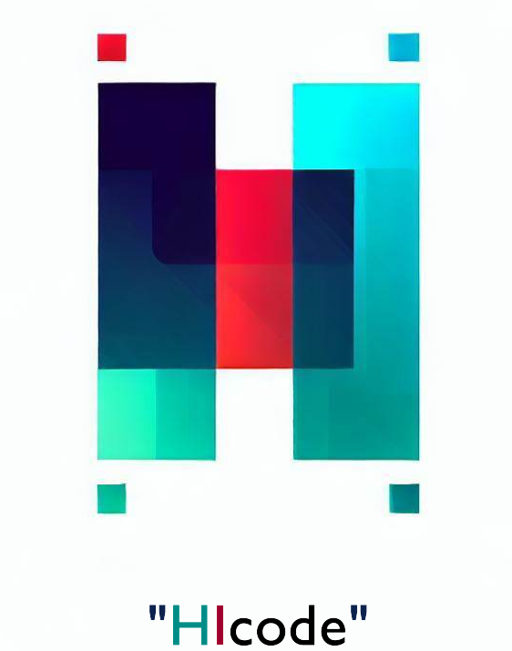

# HIcode: Halfway Integration for Seamless Data Science and Engineering Collaboration
HIcode is an impactful integration code base that harmonizes data science and engineering teams, fostering seamless collaboration. With HIcode, developers unlock the potential for a more robust and sustainable software system, maximizing project success and driving innovation. Embrace symplification! 🚀 #HIcode

*Author: nmc-costa*

## Overview

HIcode is a cutting-edge integration code base designed to facilitate seamless collaboration between data science and data engineering teams. This repository serves as a comprehensive guide for developers, outlining methodologies that simplify the process of adhering to essential principles: **DRY (Don't Repeat Yourself)**, **KISS (Keep It Simple)**, **Consistency**, and **Testing**. Emphasizing best practices, the HIcode guideline aims to elevate code quality, readability, maintainability, and scalability within data science and engineering projects. The ultimate goal is to cultivate a more robust and sustainable software system that fosters productive co-working and maximizes project success.

## Key Features

- **Empowering Collaboration**: HIcode bridges the gap between data science and engineering, promoting seamless communication and enabling both teams to work harmoniously towards common goals.

- **DRY (Don't Repeat Yourself)**: By promoting code reuse and minimizing duplication, HIcode ensures a streamlined development process, reducing the risk of inconsistencies and errors.

- **KISS (Keep It Simple)**: Simplicity is key to maintainability and understanding. HIcode encourages developers to follow a straightforward approach in crafting elegant solutions.

- **Consistency**: HIcode enforces consistent coding practices across the entire project, enhancing readability and making maintenance a breeze.

- **Testing**: Robust testing methodologies are integrated into HIcode, ensuring that code functions as expected and minimizing the potential for regressions.

## Benefits

- **Improved Code Quality**: HIcode encourages developers to adhere to best practices, resulting in cleaner, more efficient, and reliable code.

- **Enhanced Readability**: Consistent coding standards and documentation make the codebase easily understandable for all team members, facilitating knowledge transfer.

- **Greater Maintainability**: With DRY and KISS principles at its core, HIcode simplifies future changes and updates, reducing maintenance efforts.

- **Scalability**: HIcode is designed to handle project growth and complexity effectively, adapting to evolving requirements and scaling without complications.

## Get Started

To start leveraging the power of HIcode for your data science and engineering projects, follow these simple steps:

1. **Clone the Repository**: Begin by cloning this repository to your local environment using `git clone https://github.com/nmc-costa/HIcode.git`.

2. **Explore the Guidelines**: Familiarize yourself with the comprehensive [guidelines](https://github.com/nmc-costa/HIcode/blob/main/HIcode_guidelines.md) outlined in the repository, covering DRY, KISS, Consistency, and Testing principles.

3. **Apply the Principles**: Incorporate HIcode methodologies into your project development process to optimize code quality and collaboration by leveraging the base example provide in this repo.

4. **Contribute**: HIcode is an open-source project, and we welcome contributions from the community. Share your insights and improvements to enhance the codebase further.

## Join the Community

Connect with fellow data science and engineering enthusiasts, and be part of the HIcode community. Share your experiences, ask questions, and stay up-to-date with the latest advancements in collaborative coding.

- Use [issues](https://github.com/nmc-costa/HIcode/issues) to engage in discussions and seek support.

- Make [pull requests](https://github.com/nmc-costa/HIcode/pulls) to share your insights and improvements to enhance the codebase further.

## Sponsorship

Currently being tested in large projects.

We value the support of our community in advancing collaborative data science and engineering. If you believe in the mission of HIcode and would like to contribute to its development and maintenance, consider becoming a sponsor os contact us for custom services. Your support enables us to enhance the codebase, expand our resources, and provide ongoing support to the community.

- **Contact Services**: For custom HIcode in your business, [linkedin](linkedin.com/in/nuno-m-c-da-costa-a14a4349).

- **Patreon**: Show your commitment by becoming a patron on [Patreon](https://www.patreon.com/hicode). 

- **Open Collective**: Contribute to HIcode's sustainability by sponsoring us on [Open Collective](https://opencollective.com/hicode). Your donations help us cover project-related expenses and support ongoing improvements.

- **GitHub Sponsors**: Support the HIcode project through GitHub Sponsors and help us maintain its quality and accessibility. Visit our [GitHub Sponsors](https://github.com/sponsors/hicode) page to explore sponsorship options.

Your sponsorship not only assists in driving the development of HIcode but also ensures its availability as a free and open-source resource for the wider community. We are immensely grateful for your support!

*Please note: HIcode is committed to transparency and accountability. All sponsorship funds are used responsibly to enhance the project and its associated community resources.*

## License

HIcode is released under the [MIT License](https://opensource.org/licenses/MIT), granting you the freedom to use, modify, and distribute the codebase while providing attribution to the original authors.

Let's revolutionize data science and engineering collaboration with HIcode! Together, we build a stronger foundation for the future of software development. Happy coding!

*Please note: The HIcode repository is maintained and updated to incorporate emerging best practices and advancements. Be sure to check back for the latest improvements.*
